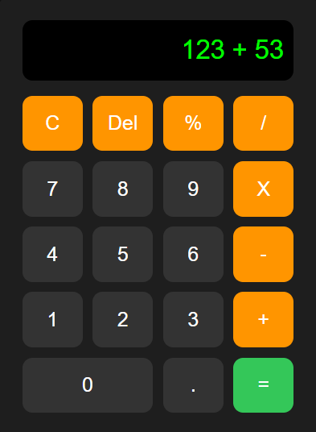

# 🧮 Calculator Using HTML, CSS & JavaScript

A **fully functional calculator** built using **HTML, CSS, and JavaScript**.  
This project is **beginner-friendly** and explains how real calculator logic works without using `eval()`.

📺 This repository is linked with my **YouTube tutorial**, where I explain the complete code step by step.

---

## 🚀 Live Demo
🔗 **Live Calculator:**  
https://aarav12e.github.io/html-css-js-calculator/

---

## 📸 Project Preview

---

## ✨ Features
- Displays numbers and operators clearly
- Performs:
  - Addition (+)
  - Subtraction (−)
  - Multiplication (×)
  - Division (÷)
  - Modulus (%)
- Clear (C) and Delete (⌫) functionality
- Clean JavaScript logic (no `eval`)
- Responsive and modern UI
- Beginner-friendly code structure

---

## 🛠️ Technologies Used
- **HTML** – Structure of the calculator  
- **CSS** – Styling, grid layout, hover effects  
- **JavaScript** – Calculator logic and user input handling  

---
## 🧠 How the Calculator Works
- User inputs are stored as **firstValue** and **secondValue**
- Operators are handled separately
- A boolean flag (`isSecond`) tracks whether the user is typing the second number
- Logic is written manually to simulate a real calculator

👉 Full explanation is available in the YouTube video.

---

## 📺 YouTube Tutorial
🎥 **Watch Full Explanation Here:**  
👉 *(Add your YouTube video link here)*

If you came here from YouTube, feel free to explore the code and try modifying it 🚀

---

## 🧑‍🎓 Who Is This For?
- Beginners learning **JavaScript**
- Students working on **college projects**
- Anyone starting with **frontend development**

---

## 🤝 Contributing
Contributions are welcome!  
If you find a bug or want to add features, feel free to fork this repo and submit a pull request.

---

## ⭐ Support
If you found this project helpful:
- ⭐ Star this repository
- 📺 Subscribe on YouTube
- 💬 Comment your doubts or suggestions

**Happy Coding 💻🚀**
